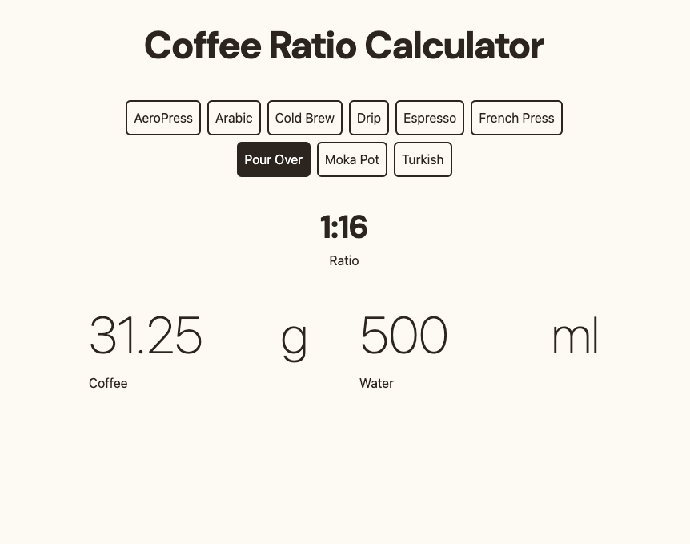

# Coffee Ratio Calculator

App for quickly calulating your brew in the monring. The app will calculate the amount of coffee needed for a given amount of water or the reverse. It has a list of preset brew methods with the optimal water to coffee ratio. This is a frontend app built with Vue.js.

[https://coffee-ratio.pages.dev/](https://coffee-ratio.pages.dev/)

## Technologies

- Cloudflare
- CSS3
- JavaScript
- TailwindCSS
- Vue.js

## Image
